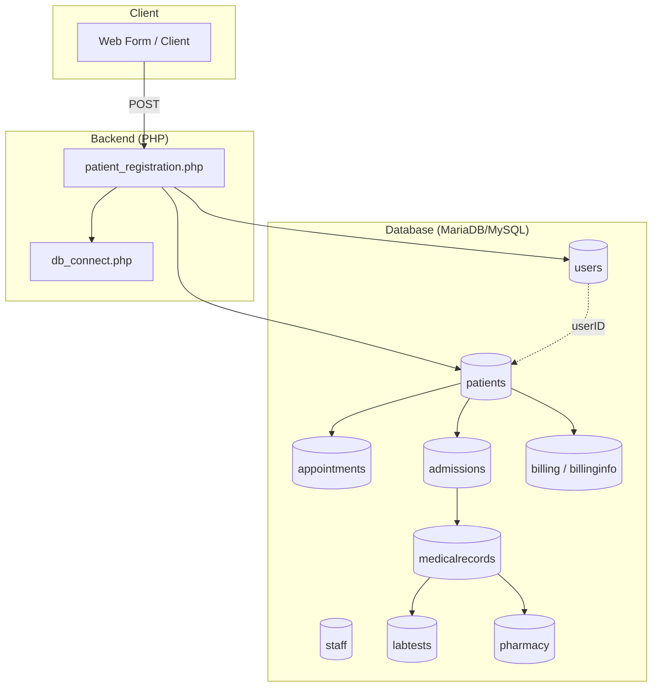
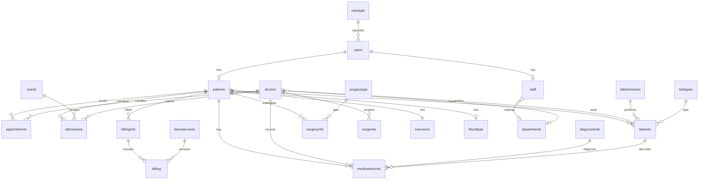
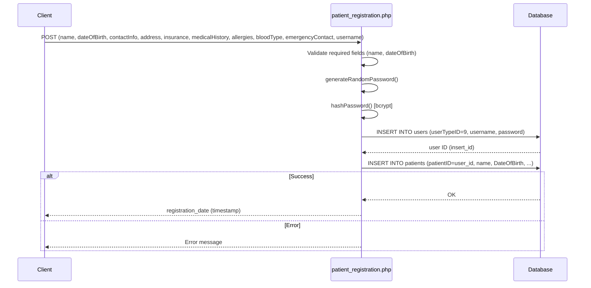
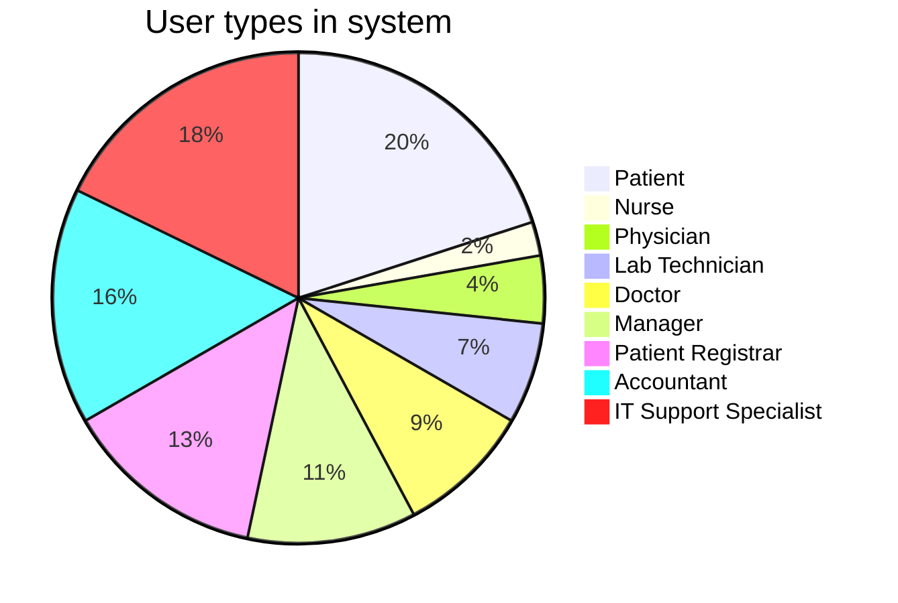

<p align="center">
  
  
  
</p>

---

# 🏥 Hospital Management System

A **database-driven hospital management system** built for a Database course assignment. It models a full healthcare facility with patients, staff, appointments, admissions, billing, medical records, lab tests, surgeries, and facility management—all backed by a normalized relational schema and a PHP patient registration API.

---

## 📋 Table of Contents

- [Overview](#-overview)
- [Architecture](#-architecture)
- [Database Schema](#-database-schema)
- [Key Features](#-key-features)
- [Tech Stack](#-tech-stack)
- [Project Structure](#-project-structure)
- [Patient Registration Flow](#-patient-registration-flow)
- [Getting Started](#-getting-started)
- [User Roles](#-user-roles)

---

## 🎯 Overview

This project provides:

| Component | Description |
|-----------|-------------|
| **Database** | `HOSPITAL.sql` — MariaDB/MySQL schema with 30+ tables, foreign keys, and stored functions for appointment chains |
| **Backend** | `patient_registration.php` — REST-style endpoint that creates a user account and patient record from form POST data |

The system supports **patient registration** (user + patient record with hashed password), and the database is designed to support appointments, admissions, billing, lab tests, surgeries, pharmacy, and administrative tasks.

---

## 🏗 Architecture



---

## 🗄 Database Schema

High-level entity relationship view:



### Core tables (summary)

| Domain | Tables |
|--------|--------|
| **Identity & access** | `users`, `usertype` |
| **People** | `patients`, `staff`, `doctors`, `nurse`, `labtechnician` |
| **Organization** | `departments`, `wards` |
| **Clinical** | `appointments`, `admissions`, `medicalrecords`, `diagnosisinfo`, `diagnosis`, `patientcare`, `caretype` |
| **Lab & pharmacy** | `labtests`, `testtypes`, `pharmacy`, `inventory` |
| **Surgery** | `surgeryinfo`, `surgerytype`, `surgeries` |
| **Billing** | `billinginfo`, `billing`, `itemsservices` |
| **Reference** | `insurance`, `bloodtype`, `facilitymanagement`, `administrativetasks` |

---

## ✨ Key Features

- **Patient registration** — Create user (type Patient) and linked patient record; random password generation and bcrypt hashing
- **Role-based users** — Patients, nurses, physicians, doctors, lab technicians, managers, registrars, accountants, IT support
- **Appointments** — With optional follow-up chain (`initialAppointmentID`); DB functions to traverse previous appointments
- **Admissions & wards** — Ward assignment, admitting doctor, admission/discharge dates
- **Billing** — Bills linked to patients and itemized services (consultation, lab, medication, etc.)
- **Medical records** — Visit date, treatment plan, diagnosis, linked lab orders
- **Lab tests** — Test types, results, status, ordering doctor, performing lab technician
- **Surgeries** — Surgery info, type, surgeon, patient
- **Pharmacy & inventory** — Medications, dosage, prescriptions; inventory with expiry and stock levels
- **Administrative** — Staff tasks, facility management (maintenance, security, cleaning)

---

## 🛠 Tech Stack

| Layer | Technology |
|-------|------------|
| Database | MariaDB 10.4+ / MySQL 8.x |
| Server | PHP 8.2+ (with MySQLi) |
| Export | phpMyAdmin 5.2 (SQL dump) |

*Note: The PHP script expects a `db_connect.php` that returns a MySQLi connection (not included in repo).*

---

## 📁 Project Structure

```
Assignment02/
├── README.md                 # This file
├── HOSPITAL.sql              # Full database schema + sample data
└── patient_registration.php  # Patient registration API (requires db_connect.php)
```

---

## 🔄 Patient Registration Flow



**Required POST fields:** `name`, `dateOfBirth`. Optional: `contactInfo`, `address`, `insurance`, `medicalHistory`, `allergies`, `bloodType`, `emergencyContact`, `username`.

---

## 🚀 Getting Started

### 1. Database setup

1. Create a database (e.g. `hospital`).
2. Import the schema and data:
   ```bash
   mysql -u your_user -p hospital < HOSPITAL.sql
   ```
   Or use phpMyAdmin: create database `hospital`, then **Import** → choose `HOSPITAL.sql`.

### 2. PHP backend

1. Add `db_connect.php` in the same directory as `patient_registration.php`, returning a MySQLi connection to the `hospital` database.
2. Ensure PHP has the MySQLi extension and uses a timezone (e.g. `Europe/Istanbul` is set in the script).
3. Point your form or client to `patient_registration.php` with a POST request containing the required/optional fields above.

### 3. Optional: `db_connect.php` example

```php
<?php
function db_connect() {
    $conn = new mysqli("127.0.0.1", "your_user", "your_password", "hospital");
    if ($conn->connect_error) {
        die("Connection failed: " . $conn->connect_error);
    }
    $conn->set_charset("utf8mb4");
    return $conn;
}
```

---

## 👥 User Roles

Defined in `usertype` and used by `users`:



| userTypeID | Role |
|------------|------|
| 1 | Nurse |
| 2 | Physician |
| 3 | Lab Technician |
| 4 | Doctor |
| 5 | Manager |
| 6 | Patient Registrar |
| 7 | Accountant |
| 8 | IT Support Specialist |
| 9 | Patient |

---

## 📜 License & Assignment

This project was developed as a **Database course assignment (Assignment 02)**. Use and modification for educational purposes is encouraged.

---

<p align="center">
  <sub>Built with MariaDB, PHP, and Mermaid</sub>
</p>
